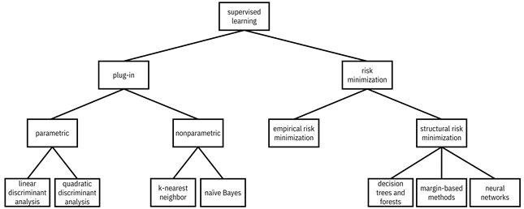

# Possible Models to be used

## Simple Models (Smoother decision boundary)

### Plug-in Models

#### Linear Discriminat Analisys (LDA) classifier
- Similar to PCA, but focuses on maximizing the separatibility among known classes instead of maximizing variance.
- Page on [sklearn](https://scikit-learn.org/stable/modules/generated/sklearn.discriminant_analysis.LinearDiscriminantAnalysis.html)

#### Quadratic Discriminant Analisys (QDA) classifier
- Similar to LDA, but allows for non-linear decision boundaries.
- Page on [sklearn](https://scikit-learn.org/stable/modules/generated/sklearn.discriminant_analysis.QuadraticDiscriminantAnalysis.html)

#### Naive Bayes
- Assumes that the features are independent given the class.
- Often, this classifier does not outperform other classifiers in terms of accuracy, so its domain of competence is often non-existent (trustworthy machine learning)
- Although naive Bayes is known as a decent classifier, it is known to be a bad estimator, so the probability outputs from predict_proba are not to be taken too seriously. (sklearn)
- Page on [sklearn](https://scikit-learn.org/stable/modules/generated/sklearn.naive_bayes.GaussianNB.html)

### Risk Minimization Models

#### Decision Trees and Forests with few trees
- Page for decision trees on [sklearn](https://scikit-learn.org/stable/modules/generated/sklearn.tree.DecisionTreeClassifier.html)
- Page for random forests on [sklearn](https://scikit-learn.org/stable/modules/generated/sklearn.ensemble.RandomForestClassifier.html)

#### Linear Logistic Regression
- Page on [sklearn](https://scikit-learn.org/stable/modules/generated/sklearn.linear_model.LogisticRegression.html)

#### Linear Support Vector Machines (SVM)
- Page on [sklearn](https://scikit-learn.org/stable/api/sklearn.svm.html)

## Complex Models (More intense variation on decision boundary)

### Plug-in Models

#### K-Nearest Neighbors (KNN)
- Look at the labels of the  closest training data points and predict whichever label is more common in those nearby points.
- Works better than other classifiers when the decision boundary is very wiggly and broken up into lots of components, and when there is not much overlap in the classes
- Page on [sklearn](https://scikit-learn.org/stable/modules/generated/sklearn.neighbors.KNeighborsClassifier.html)

### Risk Minimization Models

#### Decision Trees and Forests with many trees
- Page for decision trees on [sklearn](https://scikit-learn.org/stable/modules/generated/sklearn.tree.DecisionTreeClassifier.html)

#### Nonlinear Polynomial SVM and Nonlinear radial basis function (RBF) SVM
- Page on [sklearn](https://scikit-learn.org/stable/api/sklearn.svm.html)

#### Neural Networks Classifier
- Page on [sklearn](https://scikit-learn.org/stable/api/sklearn.neural_network.html)